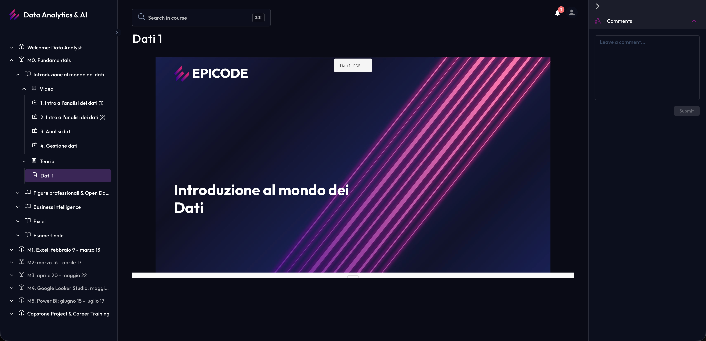

# Frontend Developer  Take-Home Challenge


> **UI Reference (Required):** `ui.png` is the target LMS screen. Your implementation in `apps/web` should match this view as closely as possible (layout, spacing, sizing, and component styling), using your `packages/design-system` components.

> **Time Limit:** 3 calendar days from receipt  
> **Stack:** Turborepo monorepo · React · TypeScript · shadcn/ui · Storybook · Vitest   (all latest stable versions)
> **Deliverable:** Working monorepo  zero compiler/build errors, zero Ultracite formatting errors

---

## TL;DR

Build **EPICODE's LMS Design System & UI** inside a Turborepo monorepo. You will:

1. Keep `packages/ui` as **untouched, primitive shadcn/ui components**
2. Create `packages/design-system`  **themed, EPICODE-branded wrappers** of those primitives
3. Wire everything into `apps/storybook` with **full controls, docs & tests**
4. Build a classic **LMS layout** (sidebar tree + content + AI chat) in `apps/web`
5. Enforce **Ultracite** formatting across the entire repo  0 errors required

---

## 1 · Monorepo Structure

```
epicode-lms/
├── apps/
│   ├── web/               # Next.js 14+ app  the LMS UI
│   └── storybook/         # Storybook 8 instance
├── packages/
│   ├── ui/                # ⛔ DO NOT MODIFY  raw shadcn/ui primitives
│   ├── design-system/     # ✅ YOUR WORK  themed EPICODE components
│   └── tsconfig/          # Shared TS configs
├── turbo.json
├── package.json
├── biome.json             # Ultracite config
└── CHALLENGE.md           # This file
```

### Key Constraint

`packages/ui` contains **vanilla shadcn/ui components** (Button, Input, Card, Dialog, Sidebar, etc.). You **must not edit** these files. They serve as the primitive layer.

`packages/design-system` is where you **import** from `packages/ui` and export **EPICODE-themed versions**  adding brand tokens, custom variants, composed components, and any overrides.

---

## 2 · Branding & Theme

### EPICODE Brand Colors

Extract the exact colors from [epicode.com](https://epicode.com). As reference:


> ⚠️ You are expected to **visit [epicode.com](https://epicode.com)** and match their actual brand as closely as possible. Use the DevTools color picker, extract from logo assets, or reference the screenshot provided. Show us you care about pixel-level brand accuracy.

You can visit https://brandfetch.com/epicode.com to get basic branding information.

### What to Deliver

- CSS custom properties in `packages/design-system/src/tokens/`
- Tailwind theme extension that maps to these tokens
- Light theme is required; dark theme is a bonus (our default is dark but some users prefer light)
- Typography scale using Outfit,Inter

---

## 3 · `packages/design-system`  Component Specifications

Import primitives from `packages/ui`, wrap/extend them, and re-export. 

### Required Components

| Component            | Base (`packages/ui`) | What You Add                                                     |
| -------------------- | -------------------- | ---------------------------------------------------------------- |
| `DsButton`           | `Button`             | EPICODE color variants, loading state, icon slot                 |
| `DsCard`             | `Card`               | Lesson card styling, progress indicator slot                     |
| `DsSidebar`          | `Sidebar`            | Collapsible, nested tree support, active state, icons            |
| `DsTreeItem`         | _custom_             | Recursive content tree node (module → lesson → sub-lesson)       |
| `DsAvatar`           | `Avatar`             | Branded fallback, online status indicator                        |
| `DsProgress`         | `Progress`           | EPICODE colors, label, percentage text                           |
| `DsBadge`            | `Badge`              | Status variants: completed, in-progress, locked, new             |
| `DsInput`            | `Input`              | Branded focus ring, error state, helper text slot                |
| `DsDialog`           | `Dialog`             | Branded header bar, consistent padding/spacing                   |
| `DsTooltip`          | `Tooltip`            | EPICODE styled with brand colors                                 |
| `DsChatBubble`       | _custom_             | AI chat message bubble  user vs assistant variants              |
| `DsChatInput`        | _custom_             | Message input with send button, attachment support                |

### Naming Convention

All design-system components are prefixed with `Ds` to distinguish them from raw primitives. Export each as both named and default.
As mentioned you can always use ready-made blocks from shadcn/ui to accelerate development OR you may tweak existing components to fit your needs.

## 4 · `apps/storybook`  Documentation & Testing

### Setup

- **Storybook 8** with `@storybook/react-vite`
- Configure to import from `packages/design-system`
- Global decorators should apply the EPICODE theme (tokens, fonts, base styles)

### Story Requirements

Every component in `packages/design-system` must have:

| Requirement          | Details                                                          |
| -------------------- | ---------------------------------------------------------------- |
| **Default Story**    | Renders the component with sensible defaults                     |
| **All Variants**     | One story per visual variant (e.g., primary, secondary, destructive buttons) |
| **Interactive Args** | All meaningful props wired as Storybook controls (argTypes)      |
| **Docs Page**        | Autodocs enabled  component description via JSDoc + `meta.parameters.docs` |
| **Playground**       | At least one story with all controls exposed for free-form testing |

### Testing Requirements

Each component needs a colocated `*.test.tsx` file:

- Renders without crashing
- Renders expected text / children
- Responds to click / interaction events where applicable
- Snapshot test (optional but appreciated)

Use **Vitest + @testing-library/react**. Tests must pass in CI: `turbo run test`.

---

## 5 · `apps/web`  LMS Layout

Build the main LMS view as a Next.js app. This is a **layout and UI exercise**, not a backend exercise. Mock all data.

### Layout: Three-Panel Design




### Left Sidebar  Content Tree

- Nested, collapsible tree: **Course → Module → Lesson → Sub-section**
- Each node shows: icon, title, completion status (badge)
- Active lesson is visually highlighted
- Sidebar is collapsible (hamburger toggle)
- Use `DsSidebar` + `DsTreeItem` from design-system

### Center  Content Area

- **Top bar:** Breadcrumb (Course > Module > Lesson), progress percentage
- **Content zone:** Lesson title, placeholder video/image area, rich text body (mocked)
- **Bottom nav:** Previous / Next lesson buttons
- Use `DsCard`, `DsButton`, `DsProgress`, `DsBadge`

### Right Panel  AI Chatbot

- Chat message history (scrollable)
- User messages right-aligned, AI messages left-aligned
- Chat input with send button at bottom
- Collapsible/toggleable panel
- Use **AI SDK UI components** ([ai/rsc](https://sdk.vercel.ai/docs), [ai-chatbot](https://github.com/vercel/ai-chatbot)) or similar off-the-shelf chat UI
- Use `DsChatBubble`, `DsChatInput` from design-system
- No need to implement the AI chat functionality, just use placeholder content for the chat messages

### Data Mocking

Create a `lib/mock-data.ts` with:


```typescript
// or choose nested structure for the content tree, whatever is more convenient for you
export type Course = {
  id: string
  title: string
  modules: Module[]
}

export type Module = {
  id: string
  title: string
  lessons: Lesson[]
}

export type Lesson = {
  id: string
  title: string
  type: 'video' | 'article' | 'quiz' //  one  content type render is enough, use placeholder content for the rest
  status: 'completed' | 'in-progress' | 'locked'
  content?: string
}
```

Provide at least **2 modules with 3-4 lessons each**, demonstrating all status types.

---

## 6 · Tooling & Quality

### Ultracite (Formatter/Linter)

**Install and configure [Ultracite](https://github.com/epicodegroup/ultracite)** as the formatter for the entire monorepo.

- `npx ultracite init` or manual setup
- Configured at monorepo root
- **0 formatting errors**  warnings are tolerable
- Add a `format` script in root `package.json`:
  ```json
  {
    "scripts": {
      "format": "ultracite",
      "format:check": "ultracite --check"
    }
  }
  ```
- Pre-commit hook (optional but appreciated)

### TypeScript

- Strict mode enabled
- No `any` types (unless absolutely necessary and commented why)
- Path aliases configured in `tsconfig.json` for clean imports

### Build Verification

The following must **all pass with 0 errors**:

```bash
turbo run build          # All apps & packages build cleanly
turbo run test           # All tests pass
turbo run format:check   # Ultracite reports 0 errors
turbo run lint           # ESLint passes (if configured)
npx storybook build      # Storybook builds to static
```

---

## 7 · Evaluation Criteria

| Criteria                  | Weight | What We Look For                                                         |
| ------------------------- | ------ | ------------------------------------------------------------------------ |
| **Architecture**          | 25%    | Clean monorepo structure, proper layer separation (ui → design-system → app) |
| **Brand Fidelity**        | 15%    | EPICODE colors, typography, and feel accurately reproduced               |
| **Component Quality**     | 20%    | Well-typed props, proper forwarding, accessible, reusable                |
| **Storybook**             | 15%    | All controls wired, docs present, stories cover variants                 |
| **LMS UI/UX**             | 10%    | Layout works, interactions are smooth, responsive considerations         |
| **Testing**               | 10%    | Meaningful tests, good coverage of edge cases                            |
| **Tooling & Polish**      | 5%     | Ultracite clean, builds pass, no dead code                               |

### Bonus Points

- ✨ Dark mode support
- ✨ Responsive / mobile-friendly sidebar collapse
- ✨ Keyboard navigation in content tree
- ✨ Animated transitions (sidebar collapse, panel toggle)
- ✨ Storybook visual regression snapshots
- ✨ i18n support
- ✨ Pre-commit hooks (husky + ultracite)
- ✨ Using shadcn blocks / directory blocks / [ai-chatbot](https://github.com/vercel/ai-chatbot) template to accelerate development

---

## 8 · Off-the-Shelf Tools Encouraged

We value **speed & smart work**. You are encouraged to use:

| Tool / Resource                     | Use Case                                    |
| ----------------------------------- | ------------------------------------------- |
| [shadcn/ui Blocks](https://ui.shadcn.com/blocks) | Pre-built layout blocks (sidebar, dashboards) |
| [shadcn Sidebar](https://ui.shadcn.com/docs/components/sidebar) | Sidebar primitive                           |
| [Vercel AI SDK](https://sdk.vercel.ai) | Chat UI components                          |
| [ai-chatbot template](https://github.com/vercel/ai-chatbot) | Full chat interface reference               |
| [assistant-ui](https://www.assistant-ui.com/) | AI chat React components                    |
| Tailwind CSS                        | All styling                                 |
| Lucide icons                        | Iconography                                 |
| Radix UI primitives                 | Via shadcn/ui  already included            |

Don't reinvent the wheel. If a shadcn block does 80% of what you need, **use it and customize**.
We're evaluating your ability to compose and theme, not to build everything from zero.

---

## 9 · Submission

## Forking & Delivery (Required)

1. Fork this repository to your own GitHub account.
2. Clone your fork locally and install dependencies:

```bash
pnpm install
```

3. (Recommended) Add the upstream remote so you can pull updates if needed:

```bash
git remote add upstream <ORIGINAL_REPO_GIT_URL>
git remote -v
```

4. Create a working branch and commit as you go:

```bash
git checkout -b feat/design-system
git add .
git commit -m "chore: initial setup"
```

5. Push your branch (or main) to your fork:

```bash
git push -u origin HEAD
```

6. When you’re ready to submit:
- Make sure the verification checklist below passes.
- Ensure the repo is accessible (public, or share access as requested).
- Email your result to `ubeyt.demir@epicode.com` with:
  - The GitHub repository link
  - Any setup notes (if non-standard)
  - Screenshots (or a link to them in the README)

### Repository

- Push to a **public GitHub repo** (or invite `epicode-hiring` if private)
- Clean git history with meaningful commit messages
- Include a `README.md` with:
  - Setup instructions (`pnpm install && turbo run dev`)
  - Available scripts
  - Architecture decisions & tradeoffs
  - Screenshot(s) of the final UI

### Verification Checklist

Before submitting, confirm:

- [ ] `pnpm install`  no errors
- [ ] `turbo run build`  0 errors
- [ ] `turbo run test`  all tests pass
- [ ] `turbo run format:check`  0 Ultracite errors
- [ ] `pnpm --filter storybook dev`  Storybook launches and all stories render
- [ ] `pnpm --filter web dev`  LMS UI launches and is interactive
- [ ] No TypeScript errors (`tsc --noEmit`)
- [ ] `packages/ui` is untouched  only primitive shadcn components

### Due Date

**3 calendar days** from the time you receive this challenge. 
We know life happens  if you need a 24h extension, just let us know proactively.

---

## 10 · Philosophy

This challenge reflects how we actually work at EPICODE:

- **Monorepo-first**  shared packages, clear boundaries
- **Design system thinking**  primitives stay primitive, branding lives in a separate layer
- **Quality bar**  builds must pass, formatting must be clean, types must be strict
- **Speed & leverage**  use existing tools smartly, don't waste time on solved problems

We're not looking for perfection. (but we wouldnt complain if you got it :P) 

We're looking for **strong fundamentals, smart decisions, and clean execution** within a tight timeframe.

---

Good luck. Build something you'd be proud to demo. 🔥