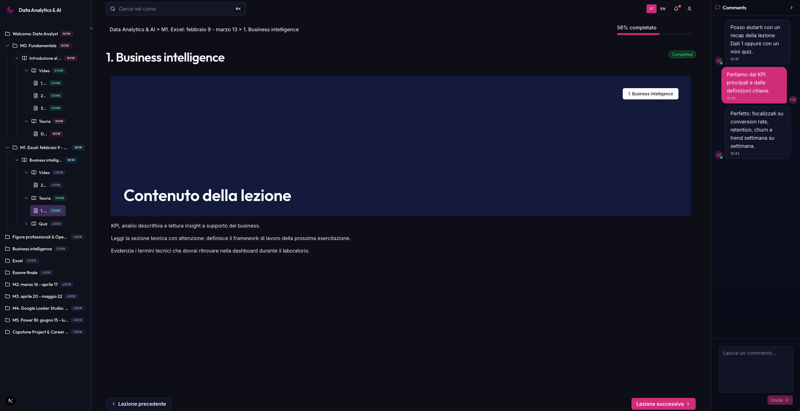

# EPICODE Frontend Challenge

Turborepo monorepo with:
- `apps/web`: LMS UI (Next.js)
- `apps/storybook`: Design System component documentation
- `packages/design-system`: EPICODE-themed wrappers
- `packages/ui`: shadcn/ui primitives (base layer)

## Requirements

- Node.js `>=20`
- pnpm `10.4.1` (or compatible)

## Quick Start

```bash
pnpm install
```

Start LMS app (`apps/web`):

```bash
pnpm --filter web dev
```

Start Storybook (`apps/storybook`):

```bash
pnpm --filter storybook dev
```

## Main Commands

### Root

| Command | What it does |
| --- | --- |
| `pnpm dev` | Starts all apps in development mode through Turbo (`turbo dev`). |
| `pnpm build` | Builds all configured workspaces (`turbo build`). |
| `pnpm lint` | Runs linting across all workspaces (`turbo lint`). |
| `pnpm test` | Runs tests across all workspaces (`turbo test`). |
| `pnpm format` | Formats the repository with Ultracite (`ultracite fix`). |
| `pnpm format:check` | Checks formatting with Ultracite (`ultracite check`). |
| `pnpm format:workspace` | Runs `format` in each workspace (`turbo run format`). |
| `pnpm format:check:workspace` | Runs `format:check` in each workspace (`turbo run format:check`). |

### Storybook (`apps/storybook`)

| Command | What it does |
| --- | --- |
| `pnpm --filter storybook dev` | Starts Storybook on port `6100`. |
| `pnpm --filter storybook build-storybook` | Creates the static Storybook build. |
| `pnpm --filter storybook dev:static` | Serves static Storybook locally on `6100`. |

### Design System (`packages/design-system`)

| Command | What it does |
| --- | --- |
| `pnpm --filter @workspace/design-system test` | Runs Vitest tests for the design-system package. |

## Full Verification (recommended)

```bash
pnpm build
pnpm test
pnpm lint
pnpm format:check
pnpm --filter storybook build-storybook
pnpm --filter web build
```

## i18n (simple)

The LMS supports language selection through query params:
- Italian: `http://localhost:3000/?lang=it`
- English: `http://localhost:3000/?lang=en`

Locale files:
- `apps/web/lib/locales/it.ts`
- `apps/web/lib/locales/en.ts`

## Architecture Decisions and Tradeoffs

- **Clear layering**: primitives in `packages/ui`, branding/theming in `packages/design-system`, final composition in `apps/web`.
- **Wrapper-first Design System**: `Ds*` components extend `ui` primitives while keeping a consistent API.
- **Dedicated Storybook app**: isolated in `apps/storybook` for independent docs and controls.
- **Minimal i18n**: no external i18n library, only `it/en` files plus a locale resolver.
- **Locale-aware mock data**: demo data is localized but remains static and intentionally simple (no backend/fetching).

## Monorepo Structure

```text
apps/
  web/
  storybook/
packages/
  ui/
  design-system/
  tsconfig/
```

## Final Result


